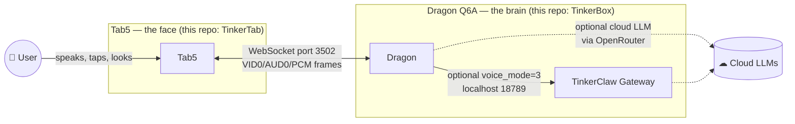
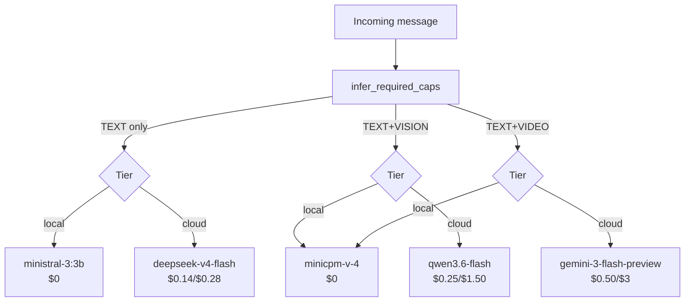
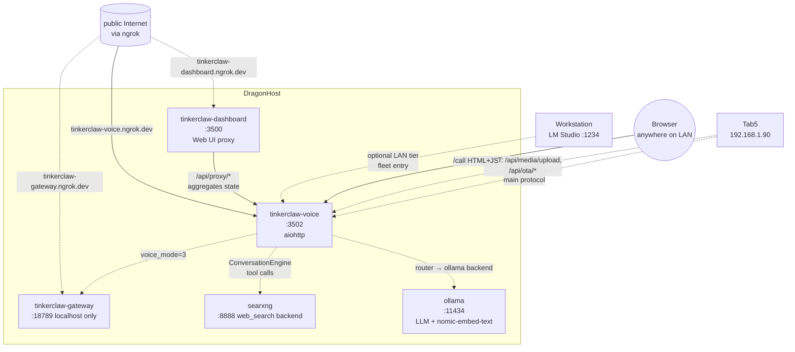

# TinkerClaw — Architecture

> **Start here if you've never seen this project before.** This doc is
> the canonical answer to "what is TinkerClaw, what runs where, and
> how do the pieces talk to each other?"  Pair it with
> [`protocol.md`](protocol.md) (the wire format) and the per-flow
> traces in [`flows/`](flows/) once you want code-level detail.

## Elevator pitch

TinkerClaw is a privacy-conscious voice assistant + skills platform
that runs entirely on hardware you own.  The user-facing device is
**Tab5** — a 5-inch portrait touchscreen that's the "face" of the
system.  All intelligence lives on **Dragon** — a 12-core ARM SBC
sitting somewhere on your LAN that runs speech-to-text, large-
language-model inference, text-to-speech, and a tool/skill registry.
A third optional layer, **TinkerClaw Gateway**, hosts the agentic
sidecar that runs longer autonomous workflows.

Tab5 is a thin client.  Dragon is the brain.  The two halves talk
over a single WebSocket connection on the LAN, with an ngrok tunnel
fallback when remote.  Cloud LLMs (Claude, GPT, Gemini, DeepSeek,
Qwen, Kimi, Grok…) are a per-session opt-in via a multi-model router
that picks per-modality per-tier — a vision turn can hit MiniCPM-V
locally while a text turn stays on the cheap cloud DeepSeek.

The product is *voice-first*: the original CDP-browser-streaming
prototype was retired in PR
[#155](https://github.com/lorcan35/TinkerTab/pull/155).  The user's
voice → Dragon's intelligence → response back to user is the loop the
whole system optimises for.

## The three pieces



| Piece | Hardware | Software | Repo | Talks to |
|-------|----------|----------|------|----------|
| **Tab5** | M5Stack Tab5 — ESP32-P4 (RISC-V dual-core), 720x1280 IPS, MIPI-CSI camera, 4-mic + DAC, WiFi via ESP32-C5 hosted, 2 MB internal SRAM + 32 MB PSRAM, 16 MB flash, 6 Ah LiPo | C / ESP-IDF 5.5.2 + LVGL 9.2.2 native UI | [TinkerTab](https://github.com/lorcan35/TinkerTab) | Dragon (WS), human (mic/touch/screen/speaker/camera) |
| **Dragon** | Radxa Q6A — Snapdragon QCS6490, 8-core Kryo (4×Cortex-A78 + 4×A55) + Adreno 643 + Hexagon V68 NPU (12 TOPS), 12 GB LPDDR5, 128 GB UFS, GbE | Python 3.12 + aiohttp + aiosqlite + Ollama + Moonshine STT + Piper TTS + nomic-embed-text + esp_video sentinel for skills | [TinkerBox](https://github.com/lorcan35/TinkerBox) (this repo) | Tab5 (WS), Cloud (HTTPS), TinkerClaw (HTTP localhost), web client at /call |
| **TinkerClaw Gateway** | Same Dragon hardware, separate process | Node.js sidecar (TypeScript), agentic runtime, browser automation via CDP | [openclaw](https://github.com/lorcan35/openclaw) | Dragon (HTTP localhost), Cloud (HTTPS), browser/Playwright, channels (WhatsApp/Telegram/Slack/iMessage/etc.) |

## The four modes

Tab5 sends a `voice_mode` (0/1/2/3) on every config change.  Dragon
hot-swaps STT/TTS/LLM backends based on it:

| Mode | voice_mode | STT | LLM | TTS | When to use |
|------|-----------|-----|-----|-----|-------------|
| **Local** | 0 | Moonshine on Dragon CPU | Local — ollama (ministral-3:3b default) or NPU Genie (llama-3.2-1b @ ~8 tok/s) | Piper on Dragon CPU | Privacy-first, slow (60-90 s/turn on Q6A); the default |
| **Hybrid** | 1 | OpenRouter `gpt-audio-mini` | Local (unchanged) | OpenRouter `gpt-audio-mini` | Fast STT/TTS, free LLM — best dollar-per-turn |
| **Full Cloud** | 2 | OpenRouter `gpt-audio-mini` | OpenRouter (router-picked or `llm_model` override) | OpenRouter `gpt-audio-mini` | Latency + quality > privacy + cost; 3-6 s/turn |
| **TinkerClaw** | 3 | Moonshine (or OR) | TinkerClaw Gateway (agent runner) | Piper (or OR) | Long-running autonomous tasks: code review, browser automation |

Switching is hot — a deep-copied per-connection config means two Tab5s
on the same Dragon can be in different modes simultaneously.  Cloud
fallback to Local fires automatically when STT/TTS API errors out.

## The router (per-modality LLM routing)

When the LLM backend is `"router"` (opt-in, see `config.yaml` →
`llm.fleet`), Dragon holds a *fleet* of LLM backends and picks per
turn based on the modalities present in the message and the active
voice_mode tier:



Lowest priority wins.  Hot-swap on voice_mode change just flips tier
policy — instantiated sub-backends survive.  Full architecture in
[`router-cookbook.md`](router-cookbook.md).

## Cross-repo data flows

The four core flows on the system, with deep-dive traces in
[`flows/`](flows/):

| Flow | Tab5 trigger | Pipeline | Doc |
|------|--------------|----------|-----|
| **Voice turn** | Push-to-talk on home orb | mic → STT → ConvEngine → router → tools/memory → TTS → speaker | [`flows/voice-turn.md`](flows/voice-turn.md) |
| **Text turn** | Chat input + Done key | text → ConvEngine → router → tools/memory → text+TTS | (variant of voice-turn — LLM path is identical) |
| **Vision turn** | Camera screen → "Send photo" | JPEG upload → router (vision-capable model) → reply | [`flows/vision-turn.md`](flows/vision-turn.md) |
| **Video call** | Nav sheet → Call tile | bidirectional VID0+AUD0 frames + browser client at `/call` | [`flows/video-call.md`](flows/video-call.md) |

## Network topology



| Port | Service | Purpose | External |
|------|---------|---------|----------|
| 3500 | dashboard.py | Web UI (11-tab SPA) | via ngrok |
| 3502 | dragon_voice (`-m dragon_voice`) | Voice WS + REST API + `/call` static | via ngrok |
| 8080 | Tab5 firmware debug server | Remote control + e2e harness target | LAN-only |
| 8888 | searxng | Self-hosted metasearch (web_search tool backend) | localhost |
| 9222 | Chromium CDP | Browser automation target | localhost |
| 11434 | ollama | LLM inference + embeddings | localhost |
| 18789 | tinkerclaw-gateway | Agentic sidecar (voice_mode=3) | localhost |

ngrok tunnels run as a single `tinkerclaw-ngrok.service`; the three
public domains map 1:1 to the three local ports above.  Tab5 firmware
tries the LAN address first then falls back to
`wss://tinkerclaw-voice.ngrok.dev:443` so the device works off-network
(travel, friend's house, etc.).  See
[`telegram-bot.md`](telegram-bot.md) for the Telegram channel
deployment as a fourth ngrok target.

## Channel Messaging Architecture

W7-F connects external messaging platforms (Telegram, WhatsApp,
Discord, Slack, Signal, iMessage, Email…) into the Tab5 voice surface.
Dragon receives a `channel_message` from the platform via the
TinkerClaw gateway on `localhost:18789` (one signed-connect handshake
per Dragon boot using an ed25519 device identity persisted at
`~/.dragon/identity/device.json`).  Dragon routes the message to the
addressed Tab5 over the existing voice WebSocket as a `channel_message`
frame; the user replies by voice on Tab5, which emits a `channel_reply`
frame back; Dragon forwards the reply to the originating platform via
the same gateway (`GatewayConnector.send_reply`), and emits a
`channel_reply_ack` to Tab5 once the platform acknowledges.  Wire
formats: see [`protocol.md`](protocol.md) §20.1 (`channel_message`),
§20.2 (`channel_reply`), §20.3 (`channel_reply_ack`).

## Voice WebSocket protocol — at a glance

The single most important contract on the system.  Full reference:
[`protocol.md`](protocol.md).

### Tab5 → Dragon (sending)

| Type | Payload | When |
|------|---------|------|
| `register` | device_id, hardware_id, capabilities, session_id | First frame after WS connect |
| `start` | optional `mode: "dictate"` | Begin streaming mic audio |
| binary (untagged) | raw 16 kHz mono int16 PCM | Mic samples (≥30 ms chunks) |
| binary `AUD0` + len + PCM | raw 16 kHz mono int16 PCM | Mic samples in **VOICE_MODE_CALL** (bypasses STT, broadcasts to other call participants) |
| binary `VID0` + len + JPEG | JPEG frame from camera | Video uplink during call |
| `stop` | (none) | End the speech turn → triggers STT |
| `cancel` | (none) | Abort current LLM/TTS generation |
| `text` | content | Skip STT, send text directly to LLM |
| `config_update` | voice_mode, llm_model, reason | Mode swap |
| `clear` | (none) | Reset conversation history |
| `ping` | (none) | Keepalive during long inference |
| `user_image` | media_id | Photo previously POSTed to `/api/media/upload` |
| `user_media` | media_id, text | Vision turn (replaces `user_image` long-term) |

### Dragon → Tab5 (receiving)

| Type | Payload | When |
|------|---------|------|
| `session_start` | session_id, config (incl. `fleet_summary` if router active) | After `register` is processed |
| `stt` / `stt_partial` | text | Transcript ready / partial during dictation |
| `llm` | text token | Streaming LLM token |
| `tool_call` / `tool_result` | tool name, args, result | Agentic activity |
| `llm_done` | llm_ms | LLM stream complete |
| `tts_start` / binary TTS / `tts_end` | 16 kHz mono PCM | Speak the response |
| `media` / `card` / `audio_clip` / `text_update` | rendered rich content | Inline chat media |
| `vision_capability` | can_see, model, per_frame_mils | Camera screen capability chip |
| `progress` | phase, fields… | β-arch unified progress event bus (issue #123) |
| `error` | code, severity, scope, message | Anything went wrong |
| `pong` | (none) | Keepalive ack |
| `config_update` | applied config (incl. `fleet_summary`) | Confirms mode swap |

## Where the code lives

The `dragon_voice` package on Dragon, decomposed in PR
[#65](https://github.com/lorcan35/TinkerBox/pull/65):

```
dragon_voice/
├── __main__.py        — `python3 -m dragon_voice` entry point
├── server.py          — VoiceServer class + create_app + WS-voice handler family
├── pipeline.py        — STT → LLM → TTS orchestration (VAD, dictation, post-process)
├── conversation.py    — ConversationEngine: multi-turn + tool-calling + memory-augmented
├── sessions.py        — SessionManager (create/resume/pause/end lifecycle)
├── messages.py        — MessageStore (append-only, multimodal-aware context builder)
├── memory.py          — MemoryService (facts + documents + RAG via nomic-embed-text)
├── db.py              — Async SQLite (aiosqlite, WAL mode)
├── config.py          — Config dataclasses (incl. ToolsConfig, MemoryConfig, fleet)
├── config.yaml        — Default configuration
│
├── llm/               — Multi-model router + 6 backends (PRs #184-#188)
│   ├── base.py        — LLMBackend ABC + Modality enum
│   ├── router.py      — CapabilityAwareRouter (the new central piece)
│   ├── ollama_llm.py  — Ollama (with OpenAI→Ollama multimodal translator)
│   ├── openrouter_llm.py — OpenRouter (35-model capability + pricing registry)
│   ├── lmstudio_llm.py   — LM Studio (LAN tier in fleet)
│   ├── npu_genie.py   — Qualcomm QAIRT/Genie (text-only, ~8 tok/s)
│   ├── tinkerclaw_llm.py — TinkerClaw gateway adapter (voice_mode=3)
│   └── dual.py        — Picker+responder (predates router)
│
├── stt/               — moonshine, whisper_cpp, vosk, openrouter
├── tts/               — piper, kokoro, edge_tts, openrouter
├── notes/             — Notes CRUD + audio ingestion (separate sub-package)
├── tools/             — ~15 tools (web_search, recall, datetime, weather, …)
├── media/             — Rich-media renderer (Pygments, Pillow), MediaStore, URL signer
├── surfaces/          — Tab5 widget abstraction (live/card/list/chart/media/prompt)
├── mcp/               — Model Context Protocol client + bridge
├── api/               — REST API package (53 endpoints)
├── handlers/          — HTTP handlers (debug, status, config_api)
├── lifecycle/         — startup, shutdown, monitors, purge
└── middleware/        — auth, rate_limit, security_headers, cors
```

Companion files at repo root: `schema.sql` (11 tables: 6 foundation +
3 memory + 2 scheduler), `dashboard.py` (port 3500 SPA), and
`tests/` (556 unit tests + the live-Dragon e2e CLI runner).

## Sessions, devices, and conversations

| Concept | Lifetime | Survives | Stored in |
|---------|----------|----------|-----------|
| **WebSocket connection** | Until network blip | Reconnect → resume same session | (in-memory) |
| **Session** | Until `paused`-aged-out (configurable, default 30 days) or explicitly ended | Reboot, reconnect, mode swap | `sessions` table |
| **Device** | Forever (registered once) | Reboot, factory reset | `devices` table |
| **Conversation** | == Session for new sessions; resumable across sessions if you re-attach | Append-only; messages never mutated | `messages` table (multimodal-aware via `__mm__:` content marker) |

A device sends `register` with a stable `device_id` (Tab5 uses the
hardware MAC).  If the device's `session_id` matches an active or
recently-paused session, Dragon resumes it and replays the last 20
messages so Tab5 chat can rehydrate without a REST round-trip.
Otherwise a new session is created.  Multi-tab/multi-device users
hit different sessions naturally.

## Hardware: Dragon Q6A reference

| Component | Spec | Notes |
|-----------|------|-------|
| SoC | Qualcomm QCS6490 | 4×Cortex-A78 @ 2.7 GHz + 4×Cortex-A55 @ 1.9 GHz |
| RAM | 12 GB LPDDR5 | Effective ceiling for fleet is ~8 GB after OS + services |
| NPU | Hexagon V68, 12 TOPS | QAIRT/Genie pipeline; Llama 3.2 1B at ~8 tok/s |
| GPU | Adreno 643 | Currently unused for inference |
| Storage | 128 GB UFS | `/home/radxa` lives here |
| Network | 1 GbE on enp1s0 | Static IP 192.168.1.91; WiFi disabled |
| OS | Ubuntu 22.04 ARM64 | Stripped: gdm3, snapd, nanobot, fwupd masked |
| Power | 12 V / 3 A barrel | Sustained ~8 W idle, ~25 W under inference load |

Voice pipeline RAM budget on a happy day:
- aiohttp + dragon_voice baseline: ~600 MB
- Moonshine medium STT: ~400 MB resident
- Piper TTS: ~150 MB resident
- ollama + ministral-3:3b: ~2.8 GB (model)
- Free for cloud responses + media buffers + in-flight LLM contexts: ~7 GB

Adding the multimodal models tightens this — `minicpm-v-4` (Q4_K_M) is
~3.1 GB and `minicpm-o-4.5` would be ~5.5 GB.  The router's
`keep_alive_s` parameter passes through to ollama so unused models
evict promptly.

## Why two repos?

The repo split exists because the deploy targets are different:
TinkerTab cross-compiles to ESP32-P4 with `idf.py` and flashes over
USB, while TinkerBox is a Python service that `scp`s to Dragon and
runs under systemd.  Versioning, CI, dependency footprint, and
contributor expertise all want to be separate.

The protocol contract in [`protocol.md`](protocol.md) is what
guarantees they can evolve independently.  Tab5 firmware can ship a
new feature behind a capability flag in the `register` frame; Dragon
checks the flag before relying on it.

## Where to go next

Depending on what you're trying to do:

| Goal | Read |
|------|------|
| Implement a Tab5-compatible client | [`protocol.md`](protocol.md) — full WS reference |
| Trace one concrete request through the system | [`flows/voice-turn.md`](flows/voice-turn.md) (or `vision-turn.md`, `video-call.md`) |
| Configure the LLM router fleet | [`router-cookbook.md`](router-cookbook.md) |
| Author a skill that emits widgets | [`SKILL_AUTHORING.md`](SKILL_AUTHORING.md) + TinkerTab's [`docs/WIDGETS.md`](https://github.com/lorcan35/TinkerTab/blob/main/docs/WIDGETS.md) |
| Set up the NPU LLM pipeline | [`npu-setup.md`](npu-setup.md) |
| Look up an unfamiliar term | [`../GLOSSARY.md`](../GLOSSARY.md) |
| Operate the running system | [`../CLAUDE.md`](../CLAUDE.md) — runbook (deploy, debug, restart, monitor) |
| See past audits / progress trackers | [`historical/`](historical/) |
