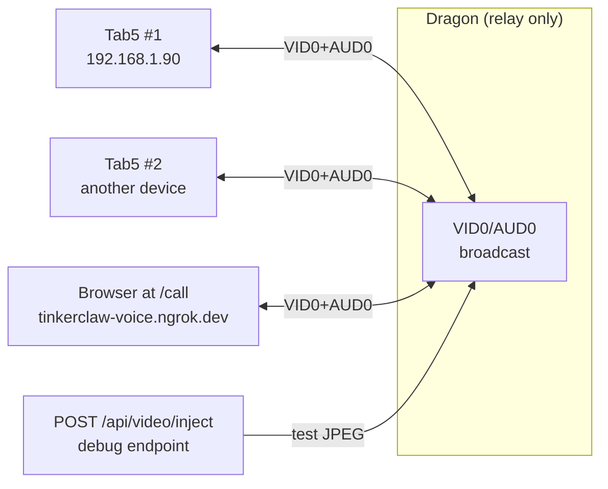
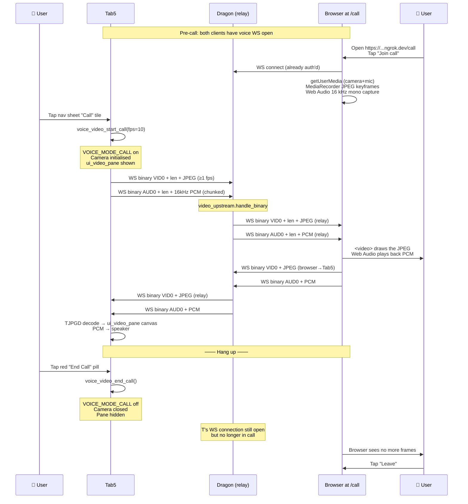

# Video Call — End-to-End Trace

> Concrete walkthrough of a two-way video call between Tab5 and a
> browser client at `/call`, with Dragon as a verbatim broadcast
> relay.  No transcoding on Dragon — frames are forwarded byte-for-
> byte to every other connected participant.

## Setup

- Tab5 at 192.168.1.90, voice WS connected.
- Browser at any LAN device, opens `https://tinkerclaw-voice.ngrok.dev/call` (or `http://192.168.1.91:3502/call` on LAN).
- Both client connections present in `_connections` on Dragon.

## The architecture

Dragon's role in a call is *deliberately stupid*: it receives `VID0`-tagged or `AUD0`-tagged binary frames from any connection and forwards them verbatim to all *other* connections (sender excluded). No transcoding, no re-encoding, no buffering beyond the WS write queue. This is the simplest thing that works and it scales naturally — adding a third participant is one more entry in the broadcast loop.



## Wire format

Tab5's video calling uses two binary-frame magic prefixes on the same WebSocket as voice:

| Magic | Direction | Payload | Module |
|-------|-----------|---------|--------|
| `VID0` (4 bytes ASCII) + 4-byte BE u32 length + bytes | both | JPEG frame | TinkerTab `voice_video.{c,h}` ↔ TinkerBox `dragon_voice/video_upstream.py` |
| `AUD0` (4 bytes ASCII) + 4-byte BE u32 length + bytes | both | raw 16 kHz mono int16 PCM | TinkerTab `voice.c` (VOICE_MODE_CALL path) ↔ same broadcaster |

Untagged binary frames are still mic PCM bound for STT — the magic tag is what disambiguates. This means:
- **Voice turn** (legacy): mic frames go to STT pipeline (no magic).
- **Call** (`VOICE_MODE_CALL` enabled): mic frames are wrapped with `AUD0` and bypass STT entirely; video uplink is `VID0`-tagged JPEG.

## Tab5 entry: `voice_video_start_call()`

[`main/voice_video.h: voice_video_start_call(int fps)`](https://github.com/lorcan35/TinkerTab/blob/main/main/voice_video.h) is the atomic entry. Triggered by:
- Nav sheet "Call" tile (`ui_nav_sheet.c`)
- Debug endpoint `POST /video/call/start?fps=15`

It does three things in order:
1. Switch voice mode to `VOICE_MODE_CALL` — the persistent mic task ([`voice.c`](https://github.com/lorcan35/TinkerTab/blob/main/main/voice.c) ~line 2400) starts wrapping frames with `AUD0` instead of feeding STT.
2. Open the camera if not already (the existing `tab5_camera_init`/`tab5_camera_capture` machinery from the camera screen).
3. Show the in-call UI overlay ([`ui_video_pane.{c,h}`](https://github.com/lorcan35/TinkerTab/blob/main/main/ui_video_pane.c)) — fullscreen video pane with a 240×135 local-camera PIP in the corner and a red "End Call" pill at the bottom.

Symmetric `voice_video_end_call()` reverses all three.

## The trace



### Tab5 → Dragon → Browser direction

#### 1. Tab5 captures + JPEG-encodes
[`voice_video.c: streaming_task`](https://github.com/lorcan35/TinkerTab/blob/main/main/voice_video.c) — persistent FreeRTOS task on Core 1. Idles on `s_event_sem` between calls; when a call is active, it captures a frame from the camera at the requested fps (default 10, max 10), applies `cam_rot` if non-zero, JPEG-encodes via the shared HW JPEG engine.

The same encoder is shared with the camera-screen recording feature (#291); a mutex inside `voice_video.c` serializes concurrent uplink + record encodes since ESP32-P4 only has one HW JPEG engine.

Output buffer is DMA-aligned via `jpeg_alloc_encoder_mem()`; the wire buffer (output + 8 byte header) is a separate plain PSRAM allocation since the WS-send path doesn't need DMA.

#### 2. Tab5 wraps + sends VID0 frame
[`voice_video.c: pack_wire_frame`](https://github.com/lorcan35/TinkerTab/blob/main/main/voice_video.c):
```
'V' 'I' 'D' '0'             // 4-byte magic
[len >> 24] [len >> 16] [len >> 8] [len]   // 4-byte BE u32 length
<JPEG bytes>                 // payload
```

`voice_ws_send_binary()` ships it. Each call connection's `aiohttp.WebSocketResponse` has an internal write queue; if the queue backs up (slow client), Tab5's send drops the frame rather than waiting. Better to drop than introduce variable lag.

#### 3. Dragon dispatches to the broadcast handler
[`dragon_voice/server.py:696+`](https://github.com/lorcan35/TinkerBox/blob/main/dragon_voice/server.py#L696) — the WS receive loop sniffs the first 4 bytes of every binary frame:
```python
if data[:4] == b"VID0":
    handler.handle_binary(ws, conn_state, data)
elif data[:4] == b"AUD0":
    handler.handle_binary(ws, conn_state, data)
else:
    # legacy untagged → mic PCM → STT pipeline
```

The handler is [`video_upstream.py: VideoUpstreamHandler`](https://github.com/lorcan35/TinkerBox/blob/main/dragon_voice/video_upstream.py).

#### 4. Verbatim broadcast
[`video_upstream.py:105+`](https://github.com/lorcan35/TinkerBox/blob/main/dragon_voice/video_upstream.py#L105) iterates `_connections` and forwards the same `data` bytes to every connection that:
- isn't the sender,
- has its WS open,
- isn't in a "muted" state (call_mute on Tab5 stops outbound AUD0 but doesn't affect VID0).

No buffering beyond aiohttp's write queue. No re-encode. The JPEG that landed at Dragon is the JPEG that lands at every other client.

#### 5. Browser receives + draws
[`dragon_voice/static/call.html`](https://github.com/lorcan35/TinkerBox/blob/main/dragon_voice/static/call.html) — the call client. Maybe 200 lines of vanilla JS:
- `ws = new WebSocket(...)` opened to the same `/ws/voice` endpoint.
- `ws.onmessage` for binary frames: peek 4-byte magic → if VID0, slice off header, blob → object URL → set as `<video>` src OR draw onto a `<canvas>`. Object URLs are revoked promptly to avoid leaking.
- For AUD0: decode the 16-bit PCM into a Float32Array, push into an `AudioBufferSourceNode` chain.

The browser's outbound side captures via `getUserMedia({video, audio})` and:
- Video: `MediaRecorder` produces JPEG keyframes (or `<canvas>` capture every N ms), wrapped with VID0 magic + length, sent as binary WS.
- Audio: `AudioContext` + `ScriptProcessorNode` (or `AudioWorkletNode`) at 16 kHz mono Float32 → int16 conversion → AUD0-wrapped chunks.

### Browser → Dragon → Tab5 direction

Mirror image of the Tab5→Browser path. Browser sends VID0+AUD0 over its own WS connection; Dragon's broadcast handler picks it up and sends it to Tab5.

#### 6. Tab5 decodes + renders
[`voice_video.c: voice_video_on_downlink_frame`](https://github.com/lorcan35/TinkerTab/blob/main/main/voice_video.c) is the entry point Dragon's relay calls (via the WS receive callback in `voice.c`). 

Step:
- Verify the magic + length.
- Allocate a slot for the JPEG payload (or reuse one from a pool).
- Schedule `tab5_lv_async_call(decode_and_blit, slot)` to hop to the LVGL thread.
- On the LVGL thread, TJPGD decodes the JPEG into the `ui_video_pane` canvas's PSRAM RGB565 buffer; `lv_obj_invalidate(canvas)` triggers the next render.

For AUD0 frames: directly pushed into the playback ring buffer (same path as TTS playback) — feeds `esp_codec_dev_write()` to the ES8388 DAC, upsampled 1:3 from 16 kHz → 48 kHz I2S rate.

The local-camera PIP in the corner is rendered separately by the streaming task — same `cam_rot` applies.

## Endpoints

| Endpoint | Purpose |
|----------|---------|
| `GET /call` | Serves `static/call.html` (the browser client). The WS endpoint it connects to is the same `/ws/voice` everyone uses. |
| `POST /api/video/inject` | Debug — pushes a JPEG into the relay as if it had come from a client. Bearer-auth. Useful for testing Tab5 downlink without a second device. |
| `GET /video` (Tab5 debug) | Stats: frames sent/received, bytes, last JPEG size, pane state. |
| `POST /video/call/start?fps=N` (Tab5 debug) | Atomic call-start (mode swap + camera open + pane show). |
| `POST /video/call/end` (Tab5 debug) | Atomic call-end. |
| `POST /call/mute` / `/call/unmute` (Tab5 debug) | Mic mute (uplink AUD0 stops; video continues). |
| `POST /call/minimize` / `/call/restore` (Tab5 debug) | Pane minimize → PIP-only / restore to fullscreen. |
| `GET /call/status` (Tab5 debug) | `{in_call, pane_visible, pane_minimized, video_stats}` snapshot. |

## Latency + bandwidth

| Hop | Typical |
|-----|---------|
| Camera capture + JPEG encode (Tab5) | ~50-100 ms per frame at 720p quality 30 |
| Tab5 WS send | ~5-15 ms LAN, ~50-200 ms via ngrok |
| Dragon relay forward | ~1-3 ms (no transcode) |
| Browser receive + decode + paint | ~10-30 ms |
| Total Tab5→Browser one-way | **~70-300 ms** depending on path |

Bandwidth at 10 fps with 30-50 KB JPEG frames: ~3-5 Mbps each direction per stream. AUD0 at 16 kHz mono int16 = 32 KB/s = ~256 kbps each direction. Total per-call: ~6-10 Mbps both ways.

## Where things go wrong

| Symptom | Cause | Mitigation |
|---------|-------|------------|
| Tab5 video pane shows last-known frame frozen | Sender (browser/other Tab5) disconnected; broadcast loop has nothing to forward | Browser shows "Waiting for participant…" message; Tab5 pane just stops updating. End the call to recover. |
| Audio underruns / gaps | Browser's `ScriptProcessorNode` not delivering frames fast enough (CPU contention) | Use `AudioWorkletNode` instead (cleaner threading); already on the roadmap. |
| Tab5 mic uplink silent | `call_mute` was set; uplink AUD0 path short-circuits | Call `/call/unmute` or tap the mute button in the UI pane. |
| `ngrok` path adds 200 ms latency | Free tier ngrok is in a US region | Use LAN address (192.168.1.91:3502) when both clients are local. |
| Browser denies camera/mic | HTTPS context required for getUserMedia, and the user has to grant permission | Ngrok provides HTTPS automatically; for local LAN access need either HTTPS reverse proxy or use `localhost`. |
| Frame drops under load | Tab5's HW JPEG engine + WS send queue can't keep up at 15 fps | Default fps is 10; reduce further if needed. The shared encoder mutex with the camera-record path can contend. |

## OPUS audio (partial)

The capability negotiation framework for OPUS shipped in TinkerBox #174 + TinkerTab #263/#265. Tab5's register frame advertises `audio_codec: ["pcm"]` for uplink (OPUS encoder gated off pending TinkerTab #264 — SILK NSQ crash on ESP32-P4) and `audio_downlink_codec: ["pcm","opus"]` for downlink. Dragon's response in `session_start.config` confirms the negotiated codec.

When OPUS uplink lands (issue #264 unblocked), the AUD0 wire format gets a sub-tag indicating codec. For now everyone uses PCM.

## TinkerClaw mode (3) does NOT use this path

`VOICE_MODE_CALL` is independent of `voice_mode` 0/1/2/3 (the STT/LLM/TTS tier picker). A call is just frames-on-the-wire; there's no LLM involvement. The router, ConversationEngine, and the entire intelligence stack are bypassed.

If a call ends and the user goes back to voice/text turns, the previous `voice_mode` (whatever it was before VOICE_MODE_CALL took over) restores.

## Related docs

- [`voice-turn.md`](voice-turn.md) — the simpler text+voice path (no calls)
- [`vision-turn.md`](vision-turn.md) — single-shot photo with ConvEngine routing
- [`../protocol.md`](../protocol.md) §18 (Video + Call Audio) — wire format reference
- [`../../GLOSSARY.md`](../../GLOSSARY.md) — `VID0`, `AUD0`, `VOICE_MODE_CALL`, `relay`
