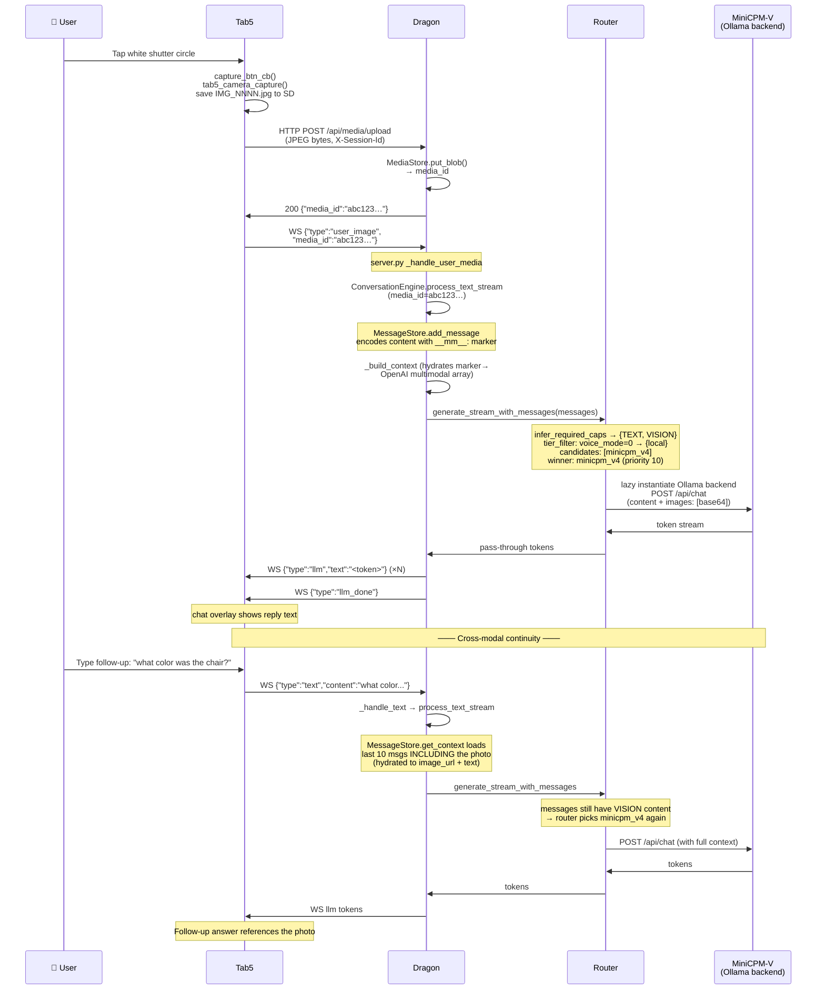

# Vision Turn — End-to-End Trace

> Concrete walkthrough of what happens when a user takes a photo on
> the Tab5 camera screen with the chat overlay armed for share.  The
> photo travels Tab5 → REST upload → Dragon media store → WS
> announcement → ConversationEngine → router (vision-capable model)
> → reply, with the photo persisted in conversation history so
> follow-up text turns still see it.  This flow is what PR #186 made
> work end-to-end.

## Setup

- Tab5 boot: WS connected to Dragon, voice_mode = 0 (Local) with router fleet active.
- Fleet's local-tier vision model: `minicpm_v4` (priority 10).
- User has just opened chat and tapped the "Send photo" button (it sets `s_chat_share_armed = true` in [`ui_camera.c`](https://github.com/lorcan35/TinkerTab/blob/main/main/ui_camera.c)).
- Camera screen now showing live viewfinder.

## The trace



### Step-by-step

#### 1. User taps the shutter button
[`main/ui_camera.c: capture_btn_cb`](https://github.com/lorcan35/TinkerTab/blob/main/main/ui_camera.c) at line ~903.  Calls `tab5_camera_capture()` to grab a frame, applies cam_rot rotation if `cam_rot != 0`, saves to `/sdcard/IMG_NNNN.jpg` (counter resumed from existing files at screen-create time).

`s_chat_share_armed` was set when the user opened the camera from the chat "Send photo" button. If true (as in this scenario), the next save also fires `voice_upload_chat_image(path)` via the shared task_worker.

#### 2. Tab5 uploads the JPEG over HTTP
[`main/voice.c: voice_upload_chat_image`](https://github.com/lorcan35/TinkerTab/blob/main/main/voice.c) loads the file from SD into a PSRAM buffer (max 6 MB per audit S2) and POSTs to `http://<dragon_host>:<dragon_port>/api/media/upload`.

```
POST /api/media/upload HTTP/1.1
Host: 192.168.1.91:3502
X-Session-Id: c3bd83829cee...
Content-Type: application/octet-stream
Authorization: Bearer <DRAGON_API_TOKEN>
Content-Length: 5290341

<JPEG bytes>
```

The upload is queued on `task_worker` (8 KB stack on shared FreeRTOS task) so the WS RX loop doesn't stall during a multi-MB transfer.

#### 3. Dragon stores the blob
[`dragon_voice/api/media_routes.py: handle_media_upload`](https://github.com/lorcan35/TinkerBox/blob/main/dragon_voice/api/media_routes.py) → [`media/store.py: MediaStore.put_blob`](https://github.com/lorcan35/TinkerBox/blob/main/dragon_voice/media/store.py).

Pillow opens the bytes (validates it's actually a JPEG/BMP/PNG), resizes to ≤ 660 px wide (dashboard + Tab5 chat constraint), re-encodes as JPEG quality 80, writes to `/home/radxa/media/<32-char-hex>.jpg`.

The 32-hex `media_id` is the SHA-256 of the resized bytes (so duplicate uploads are deduplicated naturally). MediaStore tracks creation time + an LRU access timestamp; a 24-hour TTL purger runs hourly via [`lifecycle/purge.py: media_cleanup_loop`](https://github.com/lorcan35/TinkerBox/blob/main/dragon_voice/lifecycle/purge.py).

The 200 response: `{"media_id":"5dc97c03a51c43beb80151f3e3e56a34.jpg"}`.

#### 4. Tab5 announces the image on the WS
[`voice.c: voice_send_user_image`](https://github.com/lorcan35/TinkerTab/blob/main/main/voice.c) sends:
```json
{"type":"user_image","media_id":"5dc97c03a51c43beb80151f3e3e56a34.jpg"}
```

The legacy `user_image` message and the newer `user_media` (which adds an explicit `text` field) both end up in the same handler. PR #186 unified the two paths.

#### 5. Dragon receives + capability check
[`dragon_voice/server.py: _handle_user_media`](https://github.com/lorcan35/TinkerBox/blob/main/dragon_voice/server.py#L2499) — the WS dispatcher routes `user_media` here.

First, lookup: `image_path = await self._media_store.get_path(media_id)`. If the file vanished (TTL expired, manual cleanup), respond with `error_event(code="media_not_found")` and bail.

Next, capability check (post-#300): get the active LLM via `conn_state.get("conversation")._llm`. Refuse with `error_event(code="vision_unsupported")` if `Modality.VISION not in llm.capabilities`. The check works uniformly for single-backend setups (whose `capabilities` is computed from the model id) and for the router (whose `capabilities` is the union of fleet caps in the active tier).

#### 6. Re-thread through ConversationEngine
The bug-prone old code (pre-#186) bypassed ConversationEngine entirely — the photo never made it into `messages` table, so follow-up text turns couldn't reference it. The new code:

```python
async with self._ws_keepalive_during_inference(ws, label="vision"):
    async for token in conv.process_text_stream(
        session_id=session_id,
        text=text,
        input_mode="vision",
        media_id=media_id,
    ):
        ...
```

`process_text_stream` is the canonical entry — same as text turns. The new `media_id` parameter tells it to persist the user message as a multimodal one.

#### 7. Persist the multimodal message
[`messages.py: add_message`](https://github.com/lorcan35/TinkerBox/blob/main/dragon_voice/messages.py) — when `media_id` is non-None, content is encoded as:
```
__mm__:{"media_id":"5dc97c03...","text":"What's in this image?"}
```

This lands in `messages.content` (TEXT column). The marker prefix lets `get_context` later detect a multimodal row and hydrate it back to OpenAI format. Persisting the *reference* (not the base64) keeps the DB small and ensures the Tab5 → Dragon → Tab5 chat history replay works.

> **Schema constraint:** `messages.input_mode` CHECK is `('voice','text','system')` — vision turns use `"text"` (the multimodal nature lives in the content marker, not the input_mode). LEARNINGS describes the schema migration that would relax this.

#### 8. Build context with media hydration
[`conversation.py: _build_context`](https://github.com/lorcan35/TinkerBox/blob/main/dragon_voice/conversation.py) calls `MessageStore.get_context(session_id, max_messages=10, media_store=self._media_store)`.

For each historical message with the `__mm__:` marker, [`messages.py: _hydrate_multimodal_content`](https://github.com/lorcan35/TinkerBox/blob/main/dragon_voice/messages.py) reads the file from disk, base64-encodes it inline, and returns:
```python
[
    {"type":"image_url","image_url":{"url":"data:image/jpeg;base64,..."}},
    {"type":"text","text":"What's in this image?"}
]
```

If the media file expired (TTL hit), it substitutes `f"{text} [image expired]"` so the LLM doesn't hallucinate against missing data.

The system prompt still gets memory facts + tool descriptions injected as in any text turn.

#### 9. Router routing
[`router.py: generate_stream_with_messages`](https://github.com/lorcan35/TinkerBox/blob/main/dragon_voice/llm/router.py) runs `infer_required_caps(messages)`:
- The user content has `image_url` part → `+ Modality.VISION`.
- No `video_url`, no `input_audio` → no other caps added.
- Required: `{TEXT, VISION}`.

`choose(required_caps, voice_mode=0)`:
- tier_filter: `{"local"}` from `TIER_FOR_MODE[0]`.
- candidates: filter fleet for `tier == "local"` AND `{TEXT, VISION} ⊆ capabilities`.
- With the canonical fleet, `minicpm_v4` (caps: text+vision+video, tier: local, priority: 10) is the only match.
- Winner: `minicpm_v4`.

Logged: `router: chose minicpm_v4 for [TEXT, VISION] tier=local`.

#### 10. Lazy sub-backend instantiation
First time the router needs `minicpm_v4`, it constructs an `OllamaBackend` with `ollama_model="hf.co/openbmb/MiniCPM-V-4-gguf:Q4_K_M"` and `keep_alive="120s"`. Subsequent calls reuse the same instance.

If multiple WS connections hit the router for the same spec concurrently, the `_instance_lock` serializes the construction so we never double-create.

#### 11. Ollama call with multimodal translation
[`ollama_llm.py: _translate_to_ollama_format`](https://github.com/lorcan35/TinkerBox/blob/main/dragon_voice/llm/ollama_llm.py) converts each message in the list:
- OpenAI `{"role":"user","content":[{"type":"image_url",...},{"type":"text","text":"..."}]}` →
- Ollama `{"role":"user","content":"<text part>","images":["<base64 without data: prefix>"]}`

(See LEARNINGS #90 for the ugly 400 error the system used to produce before this translator existed.)

The POST body is sent to `localhost:11434/api/chat`. Ollama hands it to the loaded MiniCPM-V model. On Dragon Q6A CPU this takes 5-7 minutes per frame (genuinely slow — see TROUBLESHOOTING). If you run the same model via LM Studio on a workstation in the LAN tier, latency drops to ~5-10 s.

#### 12. Token stream + LLM done
Same path as a text turn — tokens stream through the rolling buffer in [`conversation.py:376+`](https://github.com/lorcan35/TinkerBox/blob/main/dragon_voice/conversation.py), Tab5 sees `{"type":"llm","text":"<token>"}` events, the chat overlay accumulates the reply.

`{"type":"llm_done","llm_ms":<elapsed>}` ends the turn. Response persisted to `messages` table as a normal `assistant` row. No multimodal marker on the assistant side — Tab5 just sees text.

#### 13. (Optional) Follow-up text turn references the photo
Now the powerful part. User types "what color was the chair?" via the chat input. Tab5 sends `{"type":"text","content":"what color was the chair?"}`.

`_handle_text` → `process_text_stream` (no `media_id` this time) → `_build_context` loads the last 10 messages. The earlier user-image message is still there — `MessageStore.get_context` hydrates it back to the OpenAI multimodal array.

Router runs `infer_required_caps` again — sees the historical `image_url` content → required = `{TEXT, VISION}`. Picks `minicpm_v4` again. Pushes the full conversation to Ollama. The model sees both messages: photo + new question. Reply: "It was the green office chair near the window."

> **The "router stays sticky" pattern:** As long as the photo is in context, every turn picks the same vision model. If you let the photo age out of the 10-message window (or call `clear`), the next text turn falls back to `ministral`.

## Cost & latency

| Scenario | Frame upload | LLM time | Total |
|----------|-------------|----------|-------|
| Local mode, MiniCPM-V on Q6A CPU | ~150 ms | **~7 min** | ~7 min |
| Local mode + LAN tier (LM Studio on DGX) | ~200 ms | ~5-15 s | ~5-15 s |
| Cloud mode, qwen3.6-flash | ~300 ms | ~3-6 s | ~3-6 s |
| Cloud mode, gemini-3-flash-preview (native video) | ~300 ms | ~2-4 s | ~2-4 s |
| Cloud mode, opus-4.7 (premium) | ~300 ms | ~10-20 s | ~10-20 s |

Per-frame cost in Cloud mode: $0.0003 - $0.05 depending on model. The `vision_capability` event tells Tab5 the per-frame cost so the camera-screen chip can show "VISION · qwen3.6-flash · ~$0.0003/frame" before the user pulls the trigger.

## Where things go wrong

| Symptom | Cause | Fix / mitigation |
|---------|-------|------------------|
| `{"error":"media_not_found"}` immediately on upload | TTL expired, file deleted, or media_id typo | Re-upload; check 24h purger isn't running too aggressively |
| `{"error":"vision_unsupported"}` | Active LLM lacks Modality.VISION | Switch to a vision-capable model — Cloud mode, or add a vision spec to local fleet |
| Ollama 400 "json: cannot unmarshal array" | OllamaBackend hitting old code path | Update — this was the symptom of LEARNINGS #90 |
| Vision turn works, follow-up text doesn't see photo | `_build_context` not hydrating | Check `media_store=` is wired in `ConversationEngine.__init__` (#186 startup change) |
| haiku-3.5 returns "does not support image input" | OR brokered to Bedrock route which is text-only | Capability registry in `_OPENROUTER_CAPS` correctly declares haiku-3.5 text-only — see LEARNINGS #93 |
| MiniCPM-V hits 300s timeout | Q6A is slow; default `wait_for` is 300s | Bump `OllamaBackend.wait_for` for vision models OR move to LAN tier OR Cloud mode |

## Variations on this flow

- **Voice + image** (user speaks while showing a photo): Tab5 captures both, sends `user_media` with `text` populated by the STT result. Same router logic.
- **Image from URL** (Dragon-rendered media in chat): same MediaStore but the source is a Dragon-side render (Pygments code block, Pillow table, etc.) instead of a Tab5 upload.
- **Video frames** (future, see `video-call.md` and the `user_video` proposal): N frames sampled from a `.MJP` recording on Tab5 SD. `infer_required_caps` upgrades to `{TEXT, VIDEO}`. Router picks a VIDEO-capable model (gemini-3-flash-preview natively, or any VISION model with multi-image stitching).

## Related docs

- [`voice-turn.md`](voice-turn.md) — the simpler text-only path
- [`video-call.md`](video-call.md) — bidirectional video over WS
- [`../router-cookbook.md`](../router-cookbook.md) — fleet recipes including LAN tier
- [`../../GLOSSARY.md`](../../GLOSSARY.md) — `Modality`, `tier`, `fleet`, `multimodal marker` definitions
