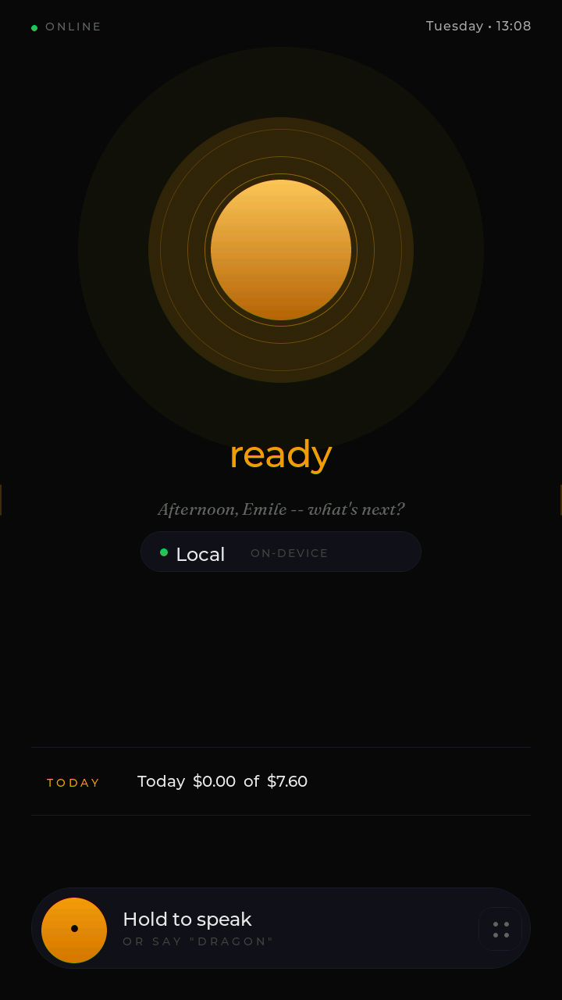
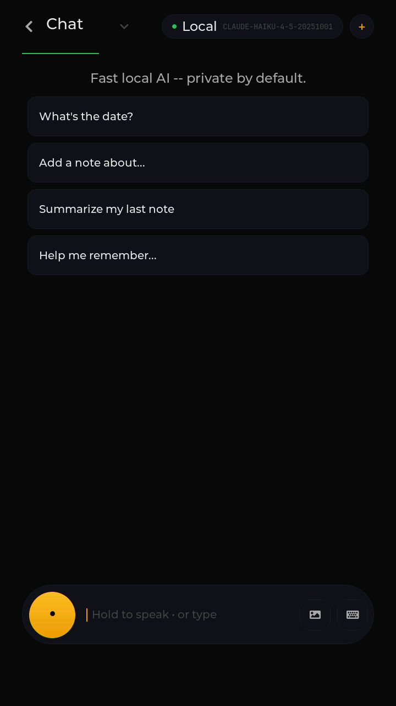
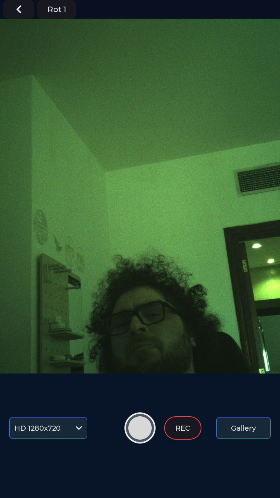
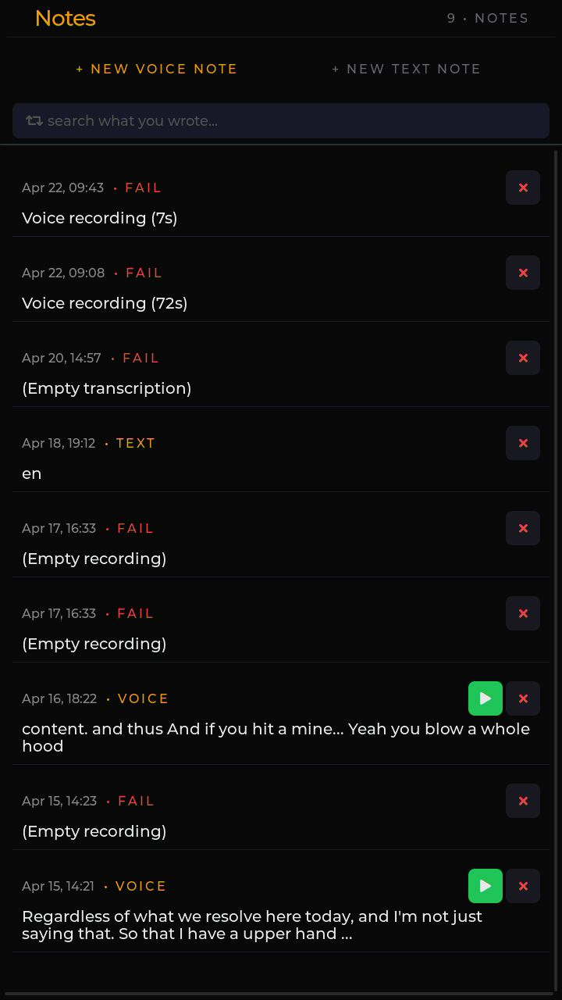
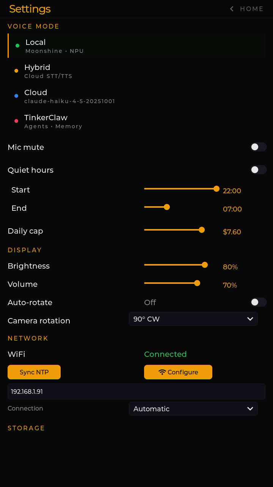

# Getting Started — for Users

> Your Tab5 just turned on. Now what?
>
> This is the user-facing quickstart. **No code, no terminal, no
> SSH.** It assumes someone has already set up Dragon for you (or
> that it came pre-configured). If you're setting up Dragon from
> scratch yourself, see [`dev-setup.md`](dev-setup.md) instead —
> that path is more involved.

  
   
  <em>Home screen on first boot — that's the glowing orb you tap to talk.</em>

---

## What you're looking at

You have two pieces:

1. **Tab5** — the 5-inch portrait touchscreen. The thing you'll
   actually talk to.  Powered by a USB-C cable.
2. **Dragon** — a small Linux box (probably hidden in a closet or on
   a shelf).  This is the "brain" — it does the speech-to-text, the
   AI thinking, and the text-to-speech.  Connected to your home WiFi
   over Ethernet, always on.

The two talk to each other over your home WiFi.  The Tab5 finds
Dragon automatically once they're both on the same network.

---

## First conversation, in 5 minutes

### Step 1 — Plug in Tab5

Use the USB-C cable + power brick that came with the Tab5.  The
screen will boot up after about 25 seconds.  You'll see:

1. A boot animation
2. A WiFi setup screen (only on first boot)
3. The home screen — a clock, a glowing orb, a greeting

### Step 2 — Connect to your WiFi (first boot only)

If the Tab5 has never seen your network before, it shows a Wi-Fi
setup screen with a list of nearby networks.

1. Tap your home network in the list
2. Tap the password field, then tap each character on the keyboard
3. Tap "Connect"

You'll see "Connected" and a tick.  Tap "Continue."

The Tab5 will then look for Dragon on the network.  If Dragon is on
and reachable, you'll see "Dragon connected" in the status bar.  If
not, you'll see "Dragon offline" — see "When something goes wrong"
below.

### Step 3 — Tap the orb, talk to it

On the home screen there's a glowing circular orb in the middle.
That's the microphone button.

1. **Tap and hold the orb.**
2. **Speak your question** — try "What time is it?"
3. **Release.** The orb dims while it thinks.
4. After a moment, the answer comes out the speaker and shows up in
   the chat overlay at the top.

That's it.  You're using a private AI assistant.

---

## What you can ask it

The default mode (Local) runs everything on your Dragon — slower
(60-90 seconds per answer) but completely private.  Try:

- "What time is it?"
- "What day is today?"
- "Calculate 456 times 789." (it'll fire a calculator tool)
- "What's the weather in Paris?" (it'll search the web)
- "Remember that my favourite colour is blue." (it'll save the fact)
- "What's my favourite colour?" (it should recall it)

If you switch to **Cloud mode** (we'll get to that), answers come
back in 3-5 seconds and quality is much higher — but it costs money
(typically pennies per conversation) and your audio + transcript
gets sent to the cloud LLM provider.

---

## The four modes (and when to use each)

The Tab5 has a small **mode chip** at the top of the home screen
that says "Local," "Hybrid," "Cloud," or "TinkerClaw."  Tap or
long-press it to bring up the mode picker.

| Mode | Speed | Privacy | Cost | Quality | Use when |
|------|-------|---------|------|---------|----------|
| **Local** (default) | Slow (~60-90s) | All local | Free | Decent for short replies | Everyday questions you don't want logged anywhere |
| **Hybrid** | Fast STT/TTS, slow LLM | Audio → cloud, thinking local | ~$0.01/turn | Local-quality replies, fast voice | Voice-driven note-taking; quick exchanges |
| **Cloud** | Fast (~3-5s) | Audio + thinking → cloud | ~$0.05-0.20/turn depending on model | Best | Real conversation, complex questions, image analysis |
| **TinkerClaw** | Slow but powerful | Mixed | varies | Excellent for long tasks | Multi-step jobs ("research this, summarise it, save the result") |

The Tab5 keeps a daily spend cap.  By default it auto-switches you
back to Local once you spend $1 in a day on Cloud.  Bump the cap in
Settings if you'd like.

---

## What you can do besides voice

### Send a photo

Tap the **camera tile** in the bottom nav sheet (swipe up from
bottom).  Take a photo with the white shutter circle, then tap "Send
photo" to share it with the AI.  Ask "What is this?" and the photo
comes back analysed.

### Type instead of speaking

Tap the **chat tile** in the nav sheet.  There's a text input at the
bottom; tap it, type, hit Done.  The AI sees it the same way as
voice (skipping the speech-to-text step).

### Take notes

Long-press the orb on the home screen instead of tapping.  This
starts **dictation mode** — record a long note (5+ minutes if you
want), it auto-stops on silence, then the AI generates a title +
summary for you.

### Make a video call

In the nav sheet there's a **Call** tile.  This starts a video call
that any browser on your network (or anywhere via the ngrok URL,
if your installer set that up) can join by visiting `/call` on
your Dragon's address.

---

## Privacy in plain English

Each mode is different.  Honest summary:

- **Local mode:** Your audio, transcript, and replies all stay on
  your Dragon.  Nothing leaves your network.  Conversation history
  is saved on Dragon's disk for 30 days then deleted.
- **Hybrid mode:** Audio is sent to OpenRouter (the cloud audio
  service) for speech-to-text and text-to-speech.  Your text prompt
  + recent conversation context stays on Dragon and gets answered
  by the local LLM.  OpenRouter sees the audio + the spoken text
  but not your prior conversation history.
- **Cloud mode:** Everything goes to OpenRouter — audio, the
  question, your recent conversation context, any photos.
  OpenRouter doesn't train on this data by default but does log it
  for billing and abuse prevention.
- **TinkerClaw mode:** Same as Cloud for the AI, but with
  additional capability to take actions on your behalf (browse
  websites, send messages, etc.) via the gateway.

Memory facts you save (via "remember this…") are stored locally on
Dragon.  Photos uploaded for analysis are deleted from Dragon after
24 hours.  WebSocket traffic between Tab5 and Dragon on your home
network is currently **not encrypted** — it's all on your LAN, but
if someone else is on your WiFi and is determined, they could see
the audio and replies.  See [`../SECURITY.md`](../SECURITY.md) for
the full story.

If you want zero cloud exposure: stay in Local mode, set
`cap_mils=0` to lock out cloud completely.

---

## Common questions

### "Why is Local mode so slow?"

The local LLM (default: ministral-3:3b) runs on Dragon's CPU,
which is a Snapdragon ARM chip — fine for a small AI but not a
desktop GPU.  Each response is 30-90 seconds of thinking.  Cloud
mode answers in 3-5 seconds because OpenRouter has datacenter
hardware.

If you want fast + private: get a workstation with a GPU running LM
Studio on your LAN, then add it as a "LAN tier" entry in Dragon's
fleet config — see [`router-cookbook.md`](router-cookbook.md).

### "Can I add my own AI model?"

Yes.  See [`router-cookbook.md`](router-cookbook.md) — it's
designed for non-experts to drop in OpenRouter model IDs or
locally-running Ollama models.

### "How do I update the firmware?"

Tab5 checks for updates from Dragon hourly.  When one's available,
the Settings screen shows an "Apply Update" button.  Tap it.  The
device reboots into the new firmware.  If something breaks during
the first boot, ESP-IDF auto-rolls back to the previous version.

### "How do I reset everything to factory?"

In Settings, scroll to "About" → "Erase NVS".  This wipes WiFi
credentials, the Dragon address, the daily spend counter, etc.
You'll need to re-do the WiFi setup on next boot.  Conversation
history lives on Dragon, not Tab5, so this won't erase that.

### "What if I want to delete my conversation history?"

On Dragon, the dashboard at `http://<your-dragon-ip>:3500` has a
**Conversations** tab where you can browse and delete sessions.
Or use the Tab5 chat screen's "New Chat" button to clear context
without deleting history.

### "What happens if Dragon goes down?"

Tab5 falls back to a "Dragon offline" indicator and stops accepting
voice input.  Notes recorded via dictation get queued locally and
upload when Dragon's back.  No data is lost.

---

## When something goes wrong

### Tab5 says "Dragon offline"

1. Check Dragon is plugged in and the Ethernet cable is in.
2. On a phone or laptop, try `http://<dragon-ip>:3502/health` — should return `{"status": "ok"}`.
3. If Dragon's reachable but Tab5 can't see it, check Tab5's saved Dragon address in Settings → "Network" → "Dragon host".
4. If you've moved Dragon to a new network, you'll need to update the address.

### Tab5 says "Connecting…" forever

1. Power-cycle Tab5 by unplugging USB-C for 5 seconds.
2. If still stuck, hold the orb during boot to enter recovery — it'll re-show the WiFi setup screen.

### "Daily budget cap reached" message

You've spent your daily Cloud-mode allowance.  Either wait until
midnight or bump the cap in Settings → "Voice & Spending" →
"Daily cap".  Local + Hybrid modes are free and unaffected.

### Voice quality is bad / robotic / glitchy

Try a different voice mode.  Cloud mode TTS is much higher quality
than local Piper.  If even Cloud TTS sounds bad, it's probably the
Tab5 speaker — check Settings → "Audio" → "Volume" and "Mute" — and
ensure nothing is covering the speaker grille.

### Camera screen shows green tint or weird colours

That's the SC202CS sensor's auto-exposure.  In low light it
oversaturates green.  Try better lighting or tap the sun icon to
manually adjust.

### Something else

The Tab5 has a built-in debug page.  On a phone or laptop on the
same WiFi, browse to `http://<tab5-ip>:8080/info` — this returns a
JSON status with heap, uptime, voice state, WiFi info.  If you want
deeper diagnostics, the full debug-server reference is in TinkerTab's
[CLAUDE.md "Debug Server" section](https://github.com/lorcan35/TinkerTab/blob/main/CLAUDE.md#debug-server-adb-style-remote-control).

If none of this works, **file an issue** with:
- What you were trying to do
- What happened instead
- The output of `http://<tab5-ip>:8080/info` if you can get it
- A screenshot if visual

---

## A tour of the screens

There are five main screens you'll bounce between. Swipe up from the bottom of any screen to bring up the nav sheet that switches between them.

### Home

  

The orb is the microphone. The pill below the orb (here showing **Local · ON-DEVICE**) is the current voice mode — tap or long-press to swap. The "Today" bar at the bottom shows how much you've spent on cloud LLM calls today; in Local mode this stays at $0.

### Chat

  

The text-input alternative to voice. Type a question, hit Done, get an answer. Same AI brain as voice — just skips the speech step. Useful when you don't want to speak out loud.

### Camera

  

White circle in the middle takes a photo (saves to SD card). Red REC button records video to SD as motion-JPEG. The dropdown picks resolution; the **Rot 1** button at the top cycles camera rotation. From the chat screen you can tap a "Send photo" button that arms the camera to share its next capture with the AI.

### Notes

  

Voice notes — long-press the orb on the home screen to start dictation. After 5 seconds of silence it auto-stops and the AI generates a title + summary. Notes show up here, searchable.

### Settings

  

Volume, brightness, mic mute, voice mode, daily spend cap, Wi-Fi info, OTA updates, "About". The three dials at the bottom (intelligence / voice / autonomy) are a more granular way to control what mode you're in than the simple Local/Hybrid/Cloud chip.

---

## Plain-English glossary

The technical [`GLOSSARY.md`](../GLOSSARY.md) is for developers. Here's the user-facing one:

- **Tab5** — the touchscreen device you talk to. It's the "face" of the system.
- **Dragon** — the small Linux computer that does the actual AI thinking. Lives somewhere on your home network. Always on.
- **Voice mode** — controls *where* the AI thinking happens.  See the table above. Tap or long-press the mode pill on the home screen to swap.
- **Orb** — the glowing circle on the home screen. Tap it to speak; long-press to record a long note.
- **Local mode** — everything stays on your Dragon, nothing leaves your house. Slow but private.
- **Cloud mode** — uses a paid AI service (Anthropic/OpenAI/Google etc.). Fast and high-quality, but costs money and sends your audio + question to the cloud.
- **Hybrid mode** — middle ground — fast voice (cloud) with private thinking (local). Good balance.
- **TinkerClaw mode** — for big multi-step tasks that need the AI to take actions on your behalf (browse the web, send messages, etc.). Most powerful, but enables the most autonomy.
- **Daily cap** — your maximum spend per day on cloud-mode AI. Defaults to $1. When you hit it, Tab5 auto-switches you back to Local mode for the rest of the day.
- **Skill** — a feature someone (a developer) added to the system. Examples: a Pomodoro timer skill, a calendar skill, a smart-home control skill. Most users won't need to think about skills; they just exist.
- **Widget** — a thing a skill draws on Tab5's screen. Live timers, cards, lists, charts, prompts. Different from chat messages.
- **Memory** — facts you've told the AI to remember. ("Remember that my favourite colour is blue.") Stored on your Dragon, recalled automatically when relevant.
- **Session** — a single conversation. Each new "New Chat" starts a new session. Your history is saved on Dragon for 30 days.
- **NVS / settings** — the tiny bit of memory inside Tab5 that remembers your Wi-Fi password, the Dragon address, and your preferences across reboots. You don't need to touch this.
- **OTA** — "over the air" — Tab5 checks Dragon hourly for firmware updates. When one's available, you tap "Apply Update" in Settings and the device reboots into the new version.
- **PTT** — "push to talk" — the "tap and hold the orb to speak" workflow.

That's the user-facing vocabulary. Anything else you bump into is in the [main GLOSSARY.md](../GLOSSARY.md) but is mostly for developers.

---

## Where to go next

You're up and running.  Want more?

- **Configure the AI's behaviour:** Settings has dials for "intelligence", "voice", "autonomy" that change how the AI replies.  Long-press the home-screen mode chip for the picker.
- **Add a skill:** [`SKILL_AUTHORING.md`](SKILL_AUTHORING.md) is the developer guide; if you're not a developer, ask one.
- **Look under the hood:** [`ARCHITECTURE.md`](ARCHITECTURE.md) explains how the system works.
- **See what just shipped:** [`release-notes.md`](release-notes.md).

Enjoy. 🐉
